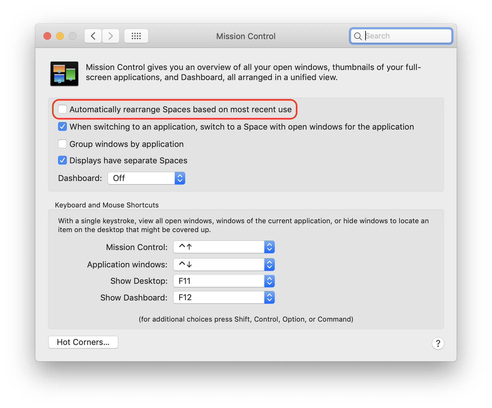
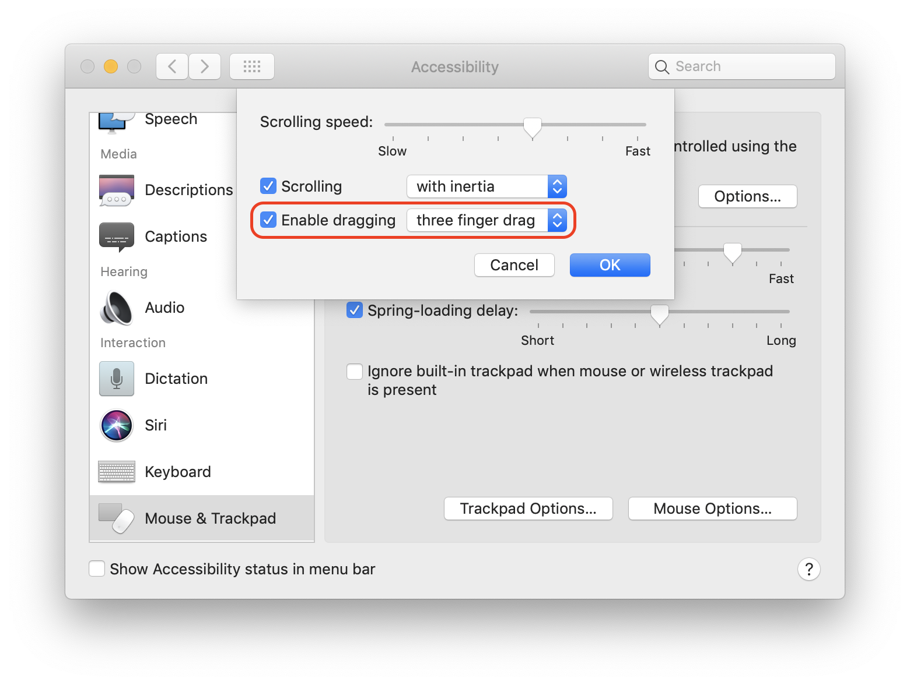
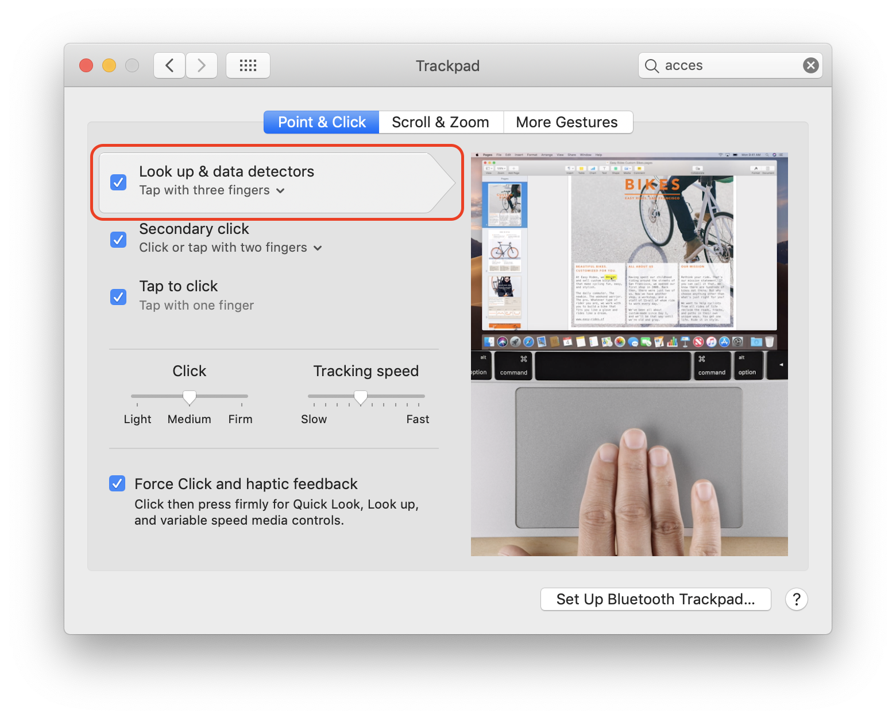
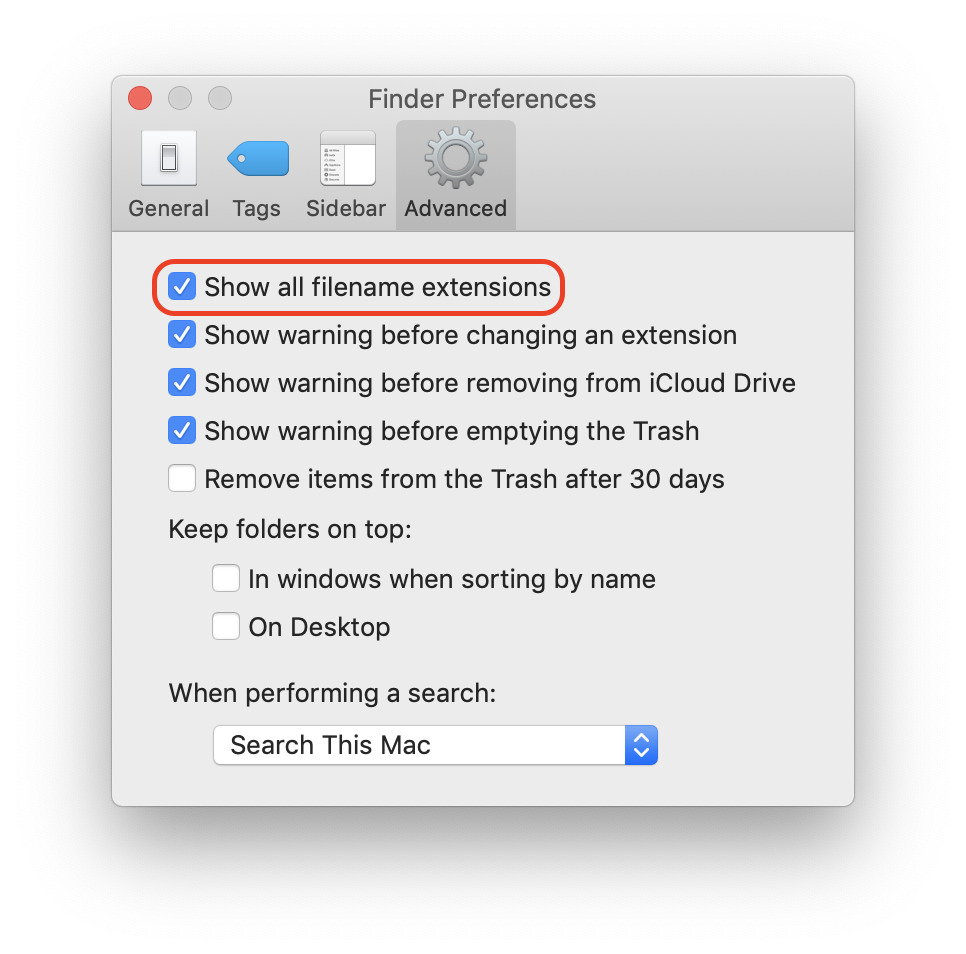
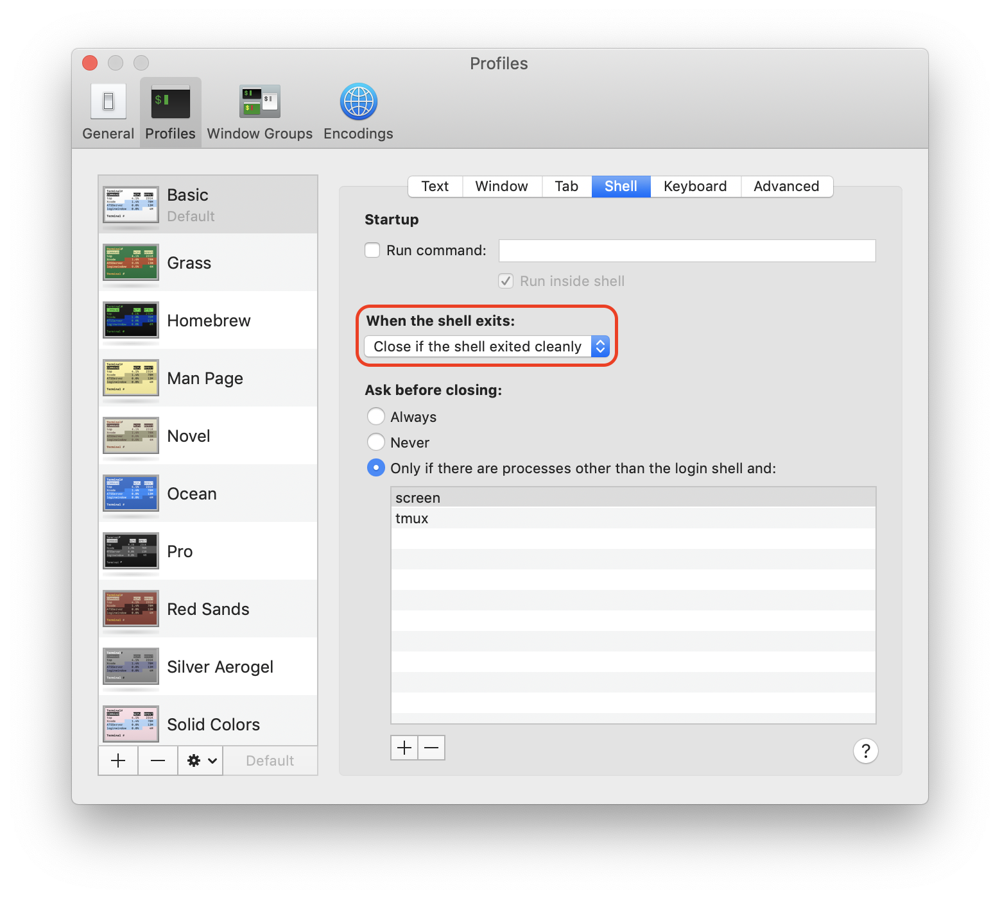
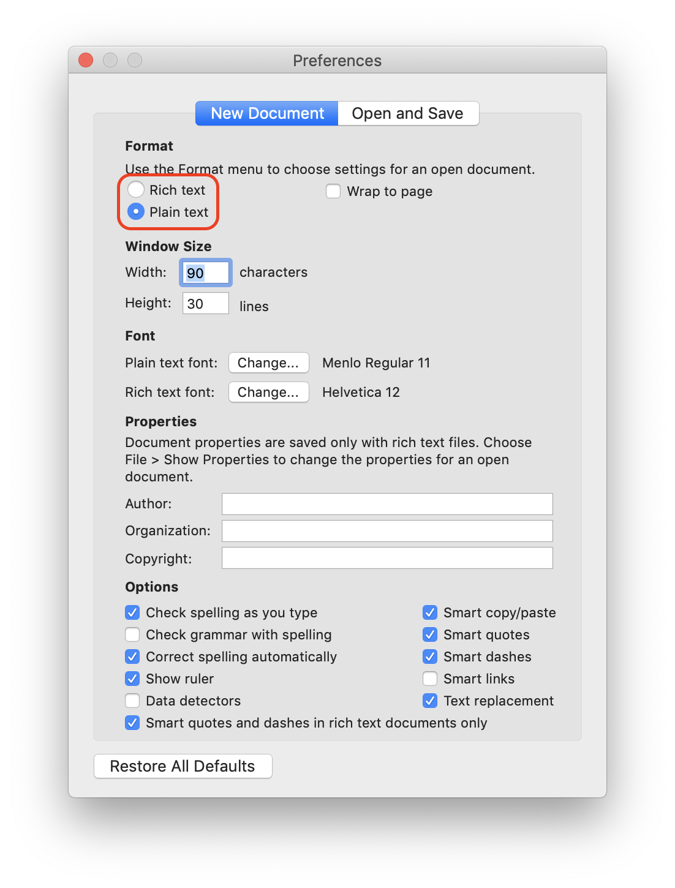
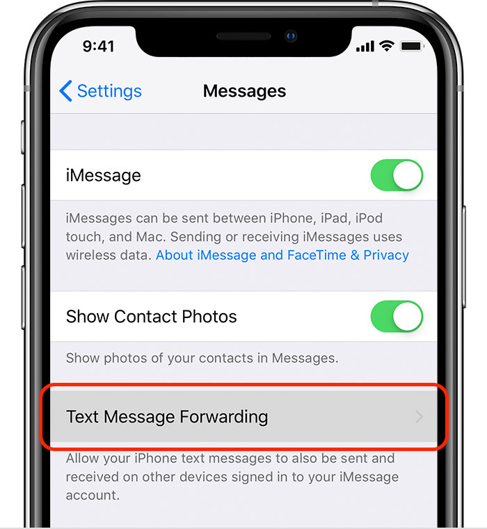
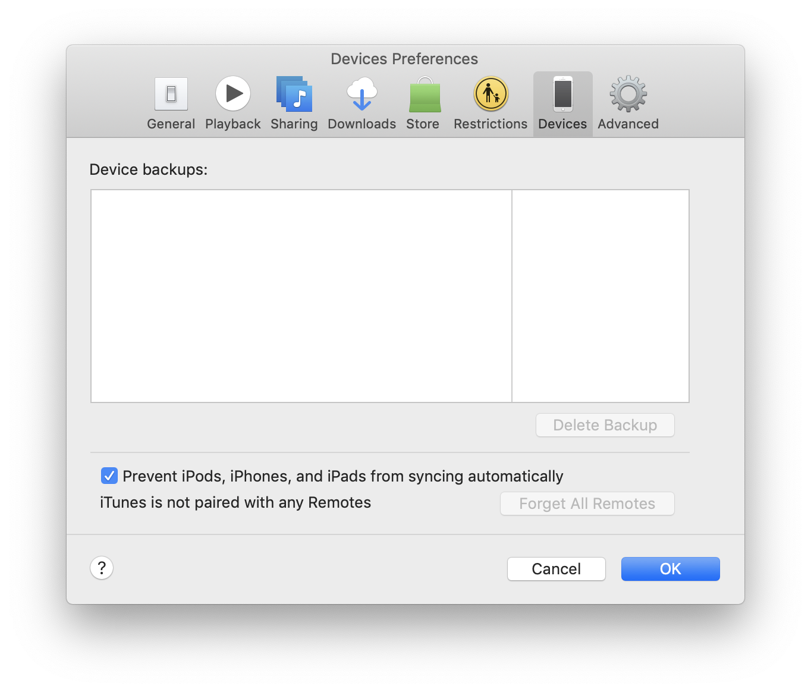
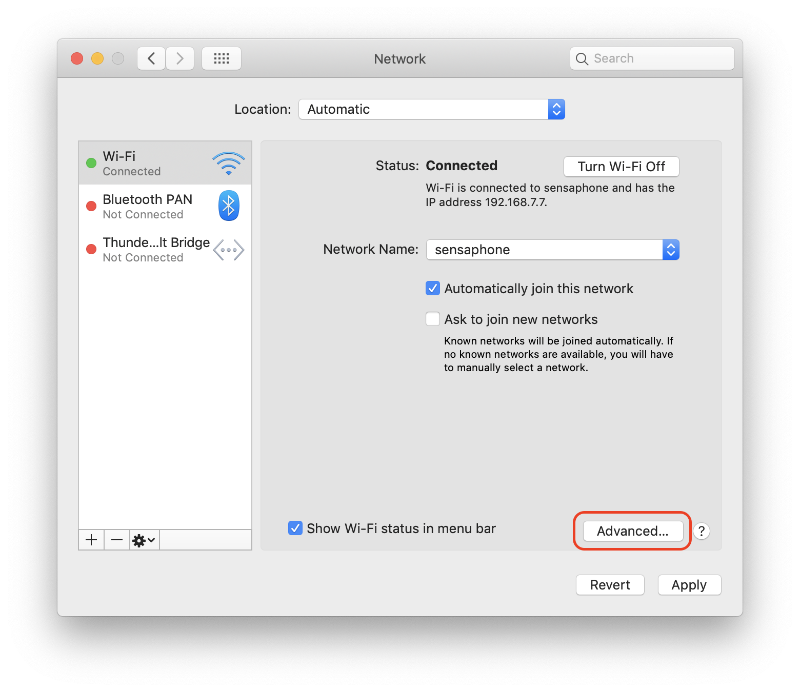
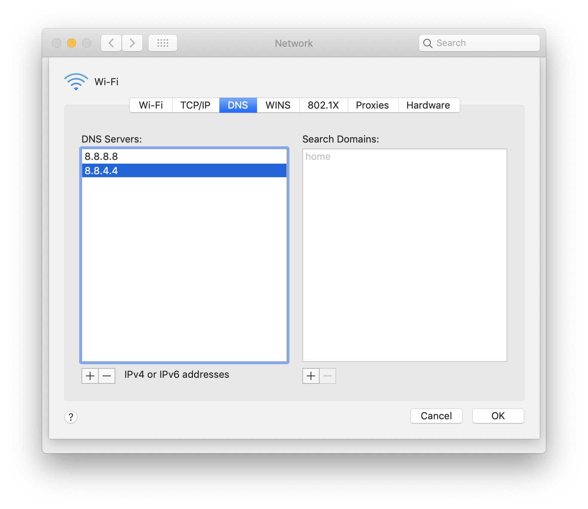

# macOS config
Steps for configuring a fresh install of macOS.

## Do Not Rearrange Spaces

Open _System Preferences_ and nvaigate to _Mission Control_. Deselect the checkbox labeled _Automatically rearrance Spaces based on most recent use_.



## Three Finger Drag

Open _System Preferences_ and navigate to _Accessibility_. Select _Mouse & Trackpad_ on the left side and click the _Trackpad Options..._ button. Select the checkbox for _Enable dragging_ and set the dropdown to _three finger drag_.



## Three Finger Look Up

Open _System Preferences_ and navigate to _Trackpad_. Set the dropdown under _Look up & data detectors_ to _Tap with three fingers_.



## Display File Name Extensions

Open _Finder_ and open _Preferences_. Navigate to _advanced_ and select the checkbox _Show all filename extensions_.



## Close Shell on Clean Exit

Open _Terminal_ and open _Preferences_. Select _Profiles_ and then _Shell_. Set the _When the shell exits_ dropdown to be _Close if the shell exited cleanly_.



## Default to Plain Text in TextEdit

Open _TextEdit_ and open _Preferences_. Select the radio button for _Plain text_.



## Enable Text Message Forwarding

On your phone go to the _Settings_ app and navigate to _Messages_. Select _Text Message Forwarding_ and enable it for the desired computers.



## Stop iTunes From Opening When Connecting iPhone

Open _iTunes_ and open _Preferences_. Navigate to _Devices_ and select the checkbox shown below.



## Homebrew

### Install Homebrew

Instructions [here](https://brew.sh/).

### Install coreutils
Install GNU's `readlink` (`greadlink`), etc.
```
brew install coreutils
```

### Install python3
```
brew install python3
```

### Install Octave
Installation instructions are [here](https://wiki.octave.org/Octave_for_macOS).  
Run the following command before opening the GUI for the first time.
```
rm .config/octave/qt-settings
```

## sshfs
https://github.com/osxfuse/osxfuse/wiki/SSHFS

## DNS for Work VPN

If there are issues with DNS while on the work VPN then open System Preferences and navigate to Network. Select _Advanced_ and navigate to _DNS_. Set the DNS servers to 8.8.8.8 and 4.4.4.4 as displayed below.




## Filemerge

Alias Filemerge to Applications so that it's easy to access.

```bash
cd /Applications/
ln -s Xcode.app/Contents/Applications/FileMerge.app/ .
```

## VSCode from Command Line

Follow [this](https://code.visualstudio.com/docs/setup/mac#_launching-from-the-command-line) guide.
